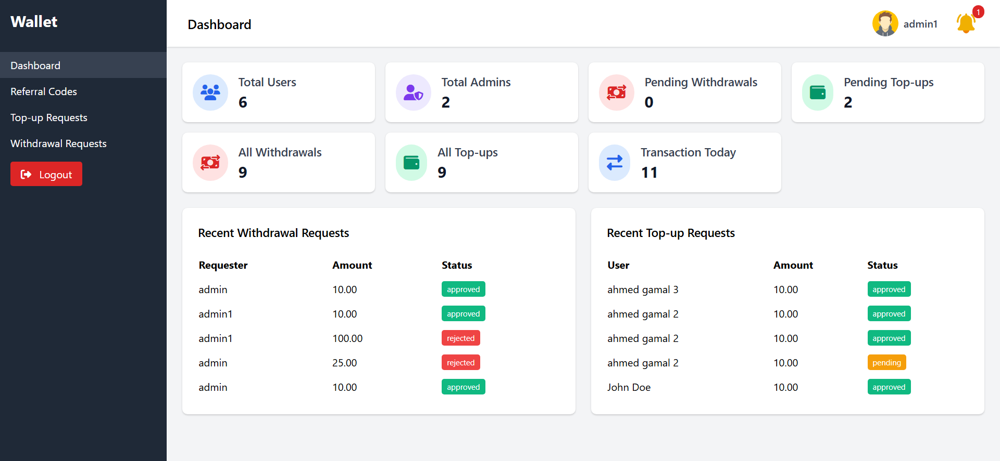
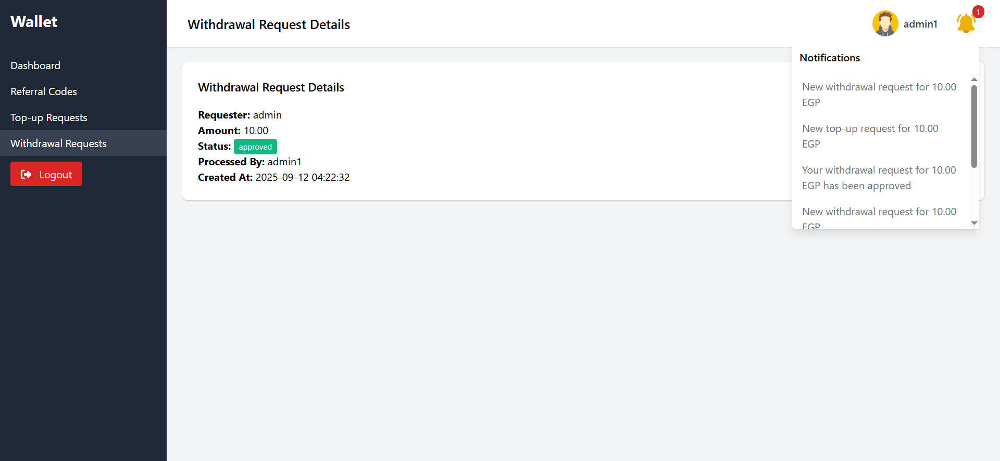
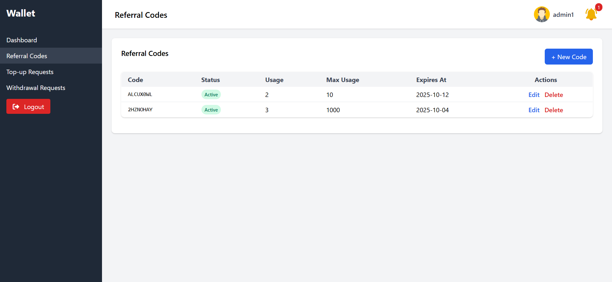
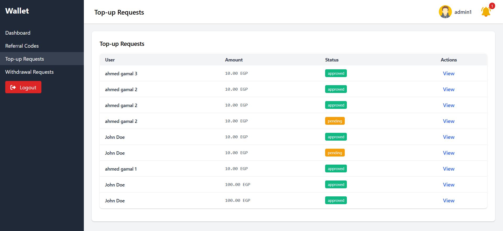
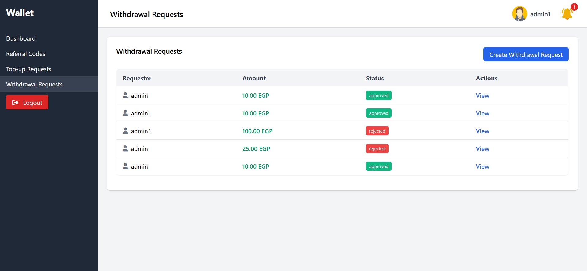
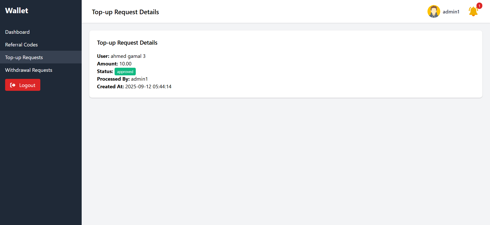
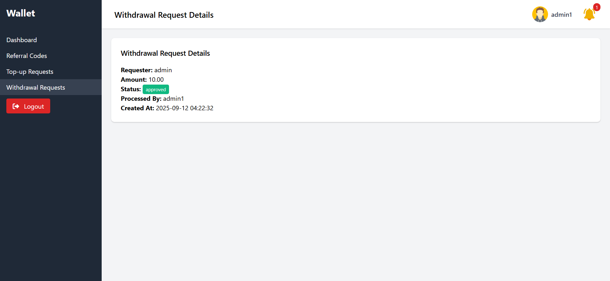
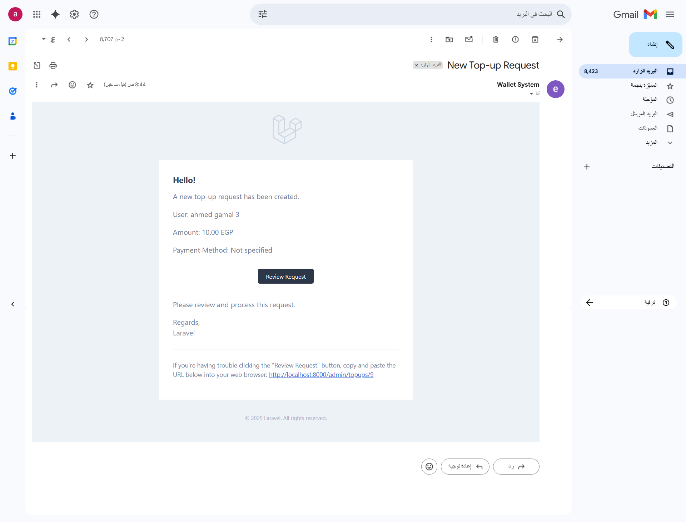

<h1>🏦 Wallet & Referral System</h1>

نظام إدارة المحافظ المالية مع الإحالات (Referral) وطلبات السحب والشحن (Withdrawals & Top-ups) مبني باستخدام <b>Laravel</b>.

<h2>📸 Screenshots</h2>

<table>
  <tr>
    <td></td>
    <td></td>
    <td></td>
  </tr>
  <tr>
    <td align="center">Dashboard</td>
    <td align="center">Notifications</td>
    <td align="center">Referral Codes</td>
  </tr>
</table>

<table>
  <tr>
    <td></td>
    <td></td>
    <td></td>
  </tr>
  <tr>
    <td align="center">Create Referral Code</td>
    <td align="center">Top-up Requests</td>
    <td align="center">Withdraw Requests</td>
  </tr>
</table>

<table>
  <tr>
    <td></td>
    <td></td>
    <td></td>
  </tr>
  <tr>
    <td align="center">Show Top-up</td>
    <td align="center">Show Withdraw</td>
    <td align="center">Mail Notifications</td>
  </tr>
</table>

<h2>🚀 Installation</h2>

<ol>
  <li><b>Clone repository</b>
    <pre><code>git clone https://github.com/your-username/your-repo.git
cd your-repo</code></pre>
  </li>

  <li><b>Install dependencies</b>
    <pre><code>composer install
npm install && npm run build</code></pre>
  </li>

  <li><b>Environment setup</b>
    <pre><code>cp .env.example .env
php artisan key:generate</code></pre>
  </li>

  <li><b>Database migration + seed</b>
    <pre><code>php artisan migrate
php artisan db:seed</code></pre>
  </li>

  <li><b>Create first admin</b>
    <pre><code>php artisan admin:create --email=admin@example.com --password=secret --name="Super Admin"</code></pre>
  </li>

  <li><b>Run server</b>
    <pre><code>php artisan serve</code></pre>
  </li>
</ol>

<h2>📬 API Documentation</h2>

يمكنك استعراض جميع الـ endpoints عبر Postman collection:  
👉 <a href="https://documenter.getpostman.com/view/25833946/2sB3HoozH1" target="_blank">API Collection</a>

<h2>⚙️ Features</h2>
<ul>
  <li>🔐 <b>Authentication Guards</b> (Admins & Users)</li>
  <li>💰 <b>Wallet Management</b> (Credit / Debit / Hold / Release)</li>
  <li>👥 <b>Referral System</b> (Admin & Users can generate codes)</li>
  <li>📥 <b>Top-up Requests</b> (Users request → Admin approve/reject)</li>
  <li>📤 <b>Withdrawal Requests</b> (Admin request → Another admin approve/reject)</li>
  <li>📢 <b>Notifications</b> (Dashboard + Email)</li>
  <li>🛡 <b>Role & Permissions</b> for Admins</li>
  <li>📊 <b>Reports & Logs</b></li>
</ul>

<h2>📄 License</h2>

This project is open-source and available under the <a href="LICENSE">MIT license</a>.

